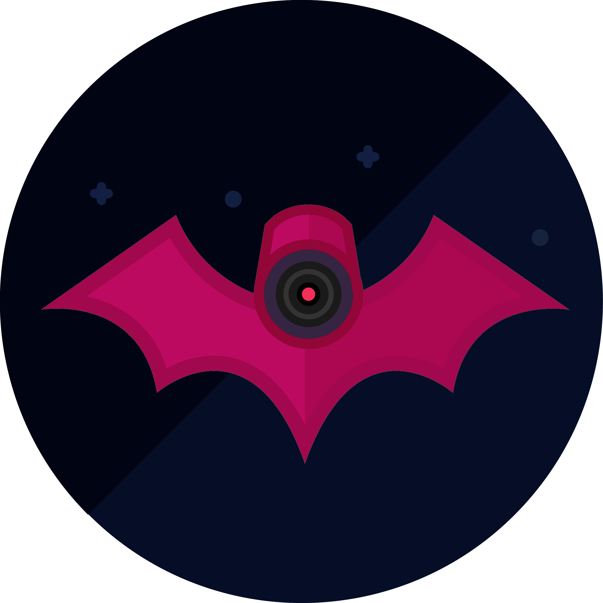

# camerattack

    

    
    
    
    
    

## An attack tool designed to remotely shut down CCTV cameras.

## Usage

Simply run it and provide it the RTSP stream URL as a parameter. Depending on your network speed and the camera you're trying to shutdown, it might work sooner or later, or might not work.

## Install instructions

Here is how to install camerattack on your machine.

### Dependencies

* `go` (> `1.10`)

### Steps to install

Make sure you installed the [dependencies](#dependencies), **and that you have Go modules enabled (`GO111MODULE=on`)**.

1. `export GO111MODULE=on` (unless it's already on or you are using go > `1.12`)
2. `go get github.com/ullaakut/camerattack`
3. `cd $GOPATH/src/github.com/ullaakut/camerattack`
4. `go install`

The `camerattack` binary is now in your `$GOPATH/bin` ready to be used.

## How does it work?

It simply does lots of requests really quickly on the device, hoping that it will crash because of a memory leak or some mistakes in its firmware's code.
